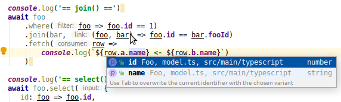

О Проекте
==============

Это простой домашний проект (pet-project) для проверки возможности написания запросов к удаленным данным в рамках языка typescript/javascript.

Мотивация написания этого проекта - нелюбовь к GraphQL, 
а в частности наличие в нем ограничений, часть функций в нем реализовать просто не возможно:

* В GraphQL просто нет синтаксической возможности создавать производные типы данных, т.е. если в том же SQL есть таблицы и есть к ним запрос, то в теле запроса мы можем указать способ связи двух таблиц (left/right/.. join) и по какому условию они связаны
* В самом GraphQL запросе, отсуствуют напрочь необходимые базовые вещи как булевые выражения (например `foo.id == bar.fooId` ), т.е. GraphQL ни как не определяет как производить фильтрацию данных, просто сам синтаксис GraphQL очень примитивен
* Можно и дальше продолжать перечислять ограничения, но даже перечисленных мне уже хватило, чтоб посмотреть на другие возможности

Ключевыми особенности проекта
-----------------------------

* Использование возможностей typescript для написания запроса к данным в функциональном стиле
* Запросы должны включать в себе функции фильтрации, join соединий и преобразования результатов на языке typescript (возможно в дальнейшем дополнение)
* Описание условий соединения, фильтрации и преобразования данных долны описываться на языке typescript/javascript
* Реальное выполнение запроса должно происходить на сервере, в том числе условий и функций typescript/javascript по возможности компилироваться в код на целевом сервером языке (groovy/sql/...)
* Должна быть обеспечены типо-безопастные конструкции


Архитектурное решение
=====================

Идея очень простая, хочеться писать код так (typescript):

```typescript
fooDatasource
   .where( foo=> foo.id==1 )
   .join( bar, (foo,bar)=> foo.id==bar.fooId )
   .fetch( row=>
      console.log( `${row.a.name} <- ${row.b.name}` )
   )
```

Запрос должен улететь на некий REST сервис и вернуть уже готовый набор данных

Данный пример это не вымешленный код, а реально работающий прототип. 

По скольку задействованы возможности typescript, то появляются следующие возможности

* typescript минимизирует ошибки и выводит типы данных
* современные редакторы idea/vs code при наборе исходного кода автоматически добавляют подсказки



Данный прототип работает благодоря двум опциям:

1. Для любой функции javascript/typescript, включая стрелочные функции возможно получить их исходный код: `arrowFn.toString()`
2. Для nodejs и для java есть уже готовые парсеры исходного кода, [esprima](https://www.npmjs.com/package/esprima) и [jdk9+](https://docs.oracle.com/en/java/javase/11/docs/api/jdk.scripting.nashorn/jdk/nashorn/api/tree/package-summary.html) соответственно.

Рассмотрим более детально что происходит на стороне клиента (nodejs) и сервера (rest) 

На стороне клиента
------------------

На стороне клиента есть следующие сущности:

* Модель данных - файл [model.ts](https://github.com/gochaorg/q2/blob/876db7f2c253946e6d6f8eb98a0fa36a2e565789/nodejs/src/main/typescript/model.ts)
* Http клиент который реализует работу с сетевыми источниками данных - файл [RemoteDataSource.ts](https://github.com/gochaorg/q2/blob/876db7f2c253946e6d6f8eb98a0fa36a2e565789/nodejs/src/main/typescript/RemoteDataSource.ts)
    * Клиент задействет библиотеку axios для обмена данными по http
    * И библиотеку esprima для парсинга стрелочных функций
* Скрипт для тестирования - файл [linq1.ts](https://github.com/gochaorg/q2/blob/876db7f2c253946e6d6f8eb98a0fa36a2e565789/nodejs/src/main/typescript/linq1.ts)

### Модель данных

Модель данных - это набор интерфейсов которые определяет программист для решения прикладной задачи, в данном примере она выглядит следующим образом:

    export interface Foo {
        id : number
        name : string    
    }
    
    export interface Bar {
        id : number
        name : string
        fooId : number
    }

В теории эту модель данных можно автоматически сгенерировать из классов/таблиц СУБД.

Данная модель [присуствует в REST сервисе](https://github.com/gochaorg/q2/tree/876db7f2c253946e6d6f8eb98a0fa36a2e565789/q2-base/src/main/groovy/xyz/cofe/q2/model)

Пример

    package xyz.cofe.q2.model
    
    /** Тестовая сущьность */
    class Bar {
        /** Конструктор по умолчанию */
        Bar(){}
    
        /**
         * Конструктор
         * @param id Идентификатор
         * @param name Имя
         * @param fooId Ссылка на foo
         */
        Bar(int id, String name, int fooId){
            this.id = id
            this.name = name
            this.fooId = fooId
        }
    
        /** Идентификатор */
        int id
    
        /** Имя */
        String name
    
        /** Ссылка на foo */
        int fooId
    }
    
В REST сервисе такие модели собираются [один набор](https://github.com/gochaorg/q2/blob/876db7f2c253946e6d6f8eb98a0fa36a2e565789/q2-base/src/main/groovy/xyz/cofe/q2/RootData.groovy)

    class RootData {
        final List<Foo> fooData = [   new Foo(1,"fooA"),
                                      new Foo(2,"fooB"),
                                      new Foo(3,"fooC")
        ]
    
        final DataSource<Foo> foo = new DataSource<>( Foo, fooData )
    
        final DataSource<Bar> bar = new DataSource<>(
            Bar,
            [
                new Bar( 3,"barA",1), new Bar( 4,"barB",1),
                new Bar( 5,"barC",2), new Bar( 6,"barD",2),
                new Bar( 7,"barE",1), new Bar( 8,"barF",5),
                new Bar( 9,"barG",1), new Bar(10,"barH",5),
                new Bar(11,"barI",2), new Bar(12,"barJ",3),
            ]
        )
    
        final MetaData meta = new MetaData(this)
    }

### Подключение модели данных на клиенте

На клиенте данные модели подключаются следующим образом

    const foo = new NamedRemoteDataSource<Foo>( 'http://localhost:19500/api', 'foo' )
    const bar = new NamedRemoteDataSource<Bar>( 'http://localhost:19500/api', 'bar' )

### Построение запроса к данным

Теперь сам запрос строиться так

    foo.where(row => row.id == 1).fetch(row => console.log(row))
    
При построении запроса не выполняются действия на клиенте, создаеться объект который описывает данный запрос, ниже его пример (в примере частично отображена структура)

    {
        "type": "Where",
        "dataSource": {    
            "type": "From",
            "name": "foo"
        },
        "filter": {
            "code": "(row) => row.id == 1",
            "ast": {
                "tree": {
                    "type": "Program",
                    "body": [{
                        "type": "ExpressionStatement",
                        "expression": {
                            "type": "ArrowFunctionExpression",
                            "id": null,
                            "params": [{
                                "type": "Identifier",
                                "name": "row"
                            }],
                            "body": {
                                "type": "BinaryExpression",
                                "operator": "==",
                                "left": {
                                    ...
                                },
                                "right": {
                                    ...
                                }
                            },
                        }
                    }],
                },
                "parser": "esprima"
            }
        }
    }

Последней инструкцией в этой цепоче методов должен быть вызов `fetch(...)`. Метод `fetch` отправляет POST запрос на REST сервис, в теле которого передается созданный объект, соответ запросу.

REST сервис обрабатывает запрос и возвращает их в виде табличных данных.

На стороне сервера
------------------

На стороне сервера присуствуют следующие части:

* Модель данных
    * [RootData](https://github.com/gochaorg/q2/blob/876db7f2c253946e6d6f8eb98a0fa36a2e565789/q2-base/src/main/groovy/xyz/cofe/q2/RootData.groovy) - корневой объект, который описывает все доступные классы/таблицы данных
* Источник данных [DataSource](https://github.com/gochaorg/q2/blob/876db7f2c253946e6d6f8eb98a0fa36a2e565789/q2-base/src/main/groovy/xyz/cofe/q2/DataSource.groovy) - класс для манипулирования данными (фильтрация/join/map и т.д...)
* [PlanBuilder](https://github.com/gochaorg/q2/blob/876db7f2c253946e6d6f8eb98a0fa36a2e565789/q2-base/src/main/groovy/xyz/cofe/q2/query/PlanBuilder.groovy) - по входным данным (json) строит соответствующий источник данных
* [EsPrimaCompiler](https://github.com/gochaorg/q2/blob/876db7f2c253946e6d6f8eb98a0fa36a2e565789/q2-base/src/main/groovy/xyz/cofe/q2/query/EsPrimaCompiler.groovy) - компилирует ast дерево переданное в запросе (в примере выше - это поле `"filter"` в json), в функцию на языке java/groovy.
* [ApiMod](https://github.com/gochaorg/q2/blob/876db7f2c253946e6d6f8eb98a0fa36a2e565789/q2-jetty/src/main/groovy/xyz/cofe/q2/jetty/api/ApiMod.groovy) - непосредственно принимает POST запрос и преобразует его в табличную форму, благодоря выше приведенным классам.

Сборка и демонстрация проекта
=============================
Инструкция для версии 

commit [876db7f2c253946e6d6f8eb98a0fa36a2e565789](https://github.com/gochaorg/q2/tree/876db7f2c253946e6d6f8eb98a0fa36a2e565789) (tag: **demo-2019-12-08**, origin/maven, maven)

В теории должно работать на распостранненых ОС (linux/windows/macos). Но по факту проверялось в ОС linux (debian, ubuntu), далее будут приведены примеры для данной ОС.

Последовательность действий

1. Установить пакеты для ОС linux
2. Клонировать репозиторий с исходниками
3. Собрать из исходников проект
4. В терминале 1 - запустить сервер q2-jetty
5. В терминале 2 - запустить тестовые скрипты nodejs

Установить пакеты для ОС linux
------------------------------

Необходимые пакеты для linux

* **npm** версии 6+
* **nodejs** версии 10+
* **jdk** версии 8+ 
* **maven** версии 3+
* **git** подойдет любая версия, которая сможет выполнить комманду git-clone

Для установки указанных пакетов выполните команду в терминале

    root@36d438066c5f:/home/code# apt-get install -y npm nodejs default-jdk maven git
    
Пояснения по коммандной строке терминала

* _root_ - это имя пользователя от которо выполняется команда, в данном случаи можете не обращать внимение, т.к. команда быдет работать и от обычного пользователя (кроме команды `apt-get install`)
* _36d438066c5f_ - это имя компьютера, в данном примере это docker контейнер
* _/home/code_ - текущий каталог

Клонировать репозиторий с исходниками
-------------------------------------

    root@36d438066c5f:/home/code# git clone https://github.com/gochaorg/q2.git 

Собрать из исходников проект
-----------------------------

В терминале выполните

    root@36d438066c5f:/home/code# cd q2
    root@36d438066c5f:/home/code/с2# mvn package

 

В терминале 1 - запустить сервер q2-jetty
-----------------------------------------

    root@36d438066c5f:/home/code/q2# ./q2-jetty/target/appassembler/bin/q2-demo-run 
    
Программа выведет следующий текст и будет ждать сообщений по http

    019-12-07 22:04:36.312:INFO::main: Logging initialized @677ms to org.eclipse.jetty.util.log.StdErrLog
    2019-12-07 22:04:36.927:INFO:oejs.Server:main: jetty-9.4.24.v20191120; built: 2019-11-20T21:37:49.771Z; git: 363d5f2df3a8a28de40604320230664b9c793c16; jvm 11.0.5+10-post-Debian-1deb10u1
    2019-12-07 22:04:36.961:INFO:oejsh.ContextHandler:main: Started o.e.j.s.h.ContextHandler@6d511b5f{/p,null,AVAILABLE}
    2019-12-07 22:04:36.988:INFO:oejs.AbstractConnector:main: Started ServerConnector@60db1c0e{HTTP/1.1,[http/1.1]}{0.0.0.0:19500}
    2019-12-07 22:04:36.990:INFO:oejs.Server:main: Started @1357ms

Прервать выполнение можно комбинацией клавиш `CTRL+C`, либо `CTRL+Z`

В терминале 2 - запустить тестовые скрипты nodejs
-------------------------------------------------

    root@36d438066c5f:/home/code/q2# node nodejs/out/linq1.js

Программа выведет следующий текст

    == fetch() ==
    { id: 1, name: 'fooA' }
    { id: 2, name: 'fooB' }
    { id: 3, name: 'fooC' }
    == where() ==
    { id: 1, name: 'fooA' }
    == join() ==
    fooA <- barA
    fooA <- barB
    fooA <- barE
    fooA <- barG
    == select() ==
    id= 1  id2= 2  name= fooA  name2= fooAfooA
    id= 2  id2= 4  name= fooB  name2= fooBfooB
    id= 3  id2= 6  name= fooC  name2= fooCfooC
